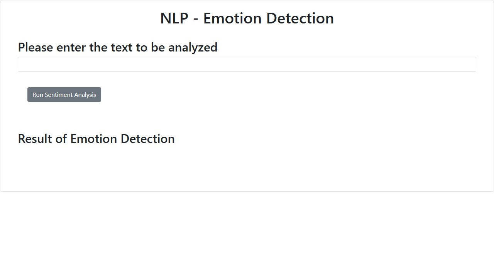

# Emotion Detector — Watson NLP + Flask

A small web app that reads a sentence and reports how much **anger, disgust, fear, joy and sadness** it expresses, along with the **dominant emotion**. The analysis comes from IBM's embeddable **Watson NLP** `EmotionPredict` model; the app is packaged as a Python module, served with Flask, and unit-tested.

*Final project for the IBM course "Developing AI Applications with Python and Flask", part of the IBM Full Stack Software Developer certificate ([verified](https://coursera.org/verify/professional-cert/ZYDXA0Y9YY1V)). Forked from the course template; the application code is mine.*



## Example

```text
GET /emotionDetector?textToAnalyze=I am glad this happened

For the given statement, the system response is 'anger': <score>, 'disgust': <score>,
'fear': <score>, 'joy': <score> and 'sadness': <score>. The dominant emotion is joy.
```

A blank input returns `Invalid text! Please try again!`: the Watson service answers `400`, and the function returns `None` for every score.

## How it works

1. `EmotionDetection.emotion_detector(text)` POSTs the text to the Watson NLP `EmotionPredict` endpoint.
2. It extracts the five scores from `emotionPredictions[0].emotion` and picks the highest as `dominant_emotion`.
3. `server.py` exposes it at `GET /emotionDetector?textToAnalyze=…` and serves the page at `/`.

## Run it

The Watson NLP endpoint is hosted inside the IBM Skills Network lab environment, so the app works end to end there. Elsewhere, point `URL` in `emotion_detection.py` at your own Watson NLP runtime.

```bash
pip install flask requests
python server.py                          # http://localhost:5000
python -m unittest test_emotion_detection.py
pylint server.py
```

## Project structure

```
├── EmotionDetection/
│   ├── __init__.py              package export
│   └── emotion_detection.py     Watson NLP call, parsing, dominant emotion, error handling
├── templates/index.html         UI
├── static/mywebscript.js        calls /emotionDetector and shows the result
├── server.py                    Flask app
└── test_emotion_detection.py    unit tests for all five emotions
```

## Tech stack

Python · Flask · IBM Watson NLP (embeddable) · requests · unittest

---

Built by **Abdullah Bokhary** · [Portfolio](https://abdullah.pageui.workers.dev/) · [LinkedIn](https://www.linkedin.com/in/abdullah-bokhary-840315326/) · [GitHub](https://github.com/abdullah2036)
